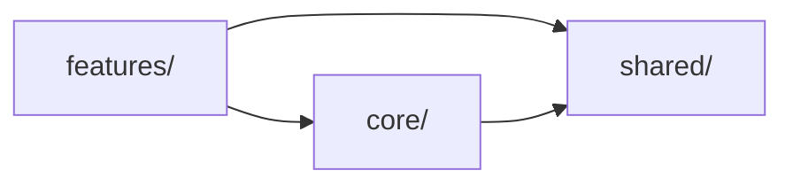
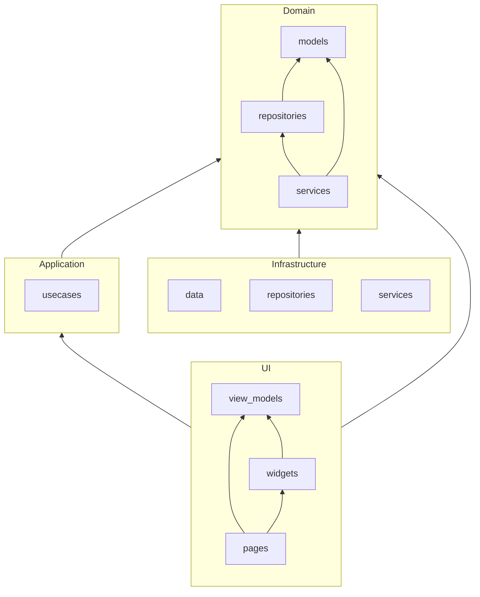

# Flutter Clean Architecture & MVVM Manual

A comprehensive guide to structuring a **Flutter** project using **Clean Architecture** and **MVVM** patterns. This manual adopts a **feature-based** modular approach, distinguishing between **Core**, **Shared**, and **Feature** domains while maintaining clear application layers. Detailed code examples and dependency graphs are provided for each folder and layer, making it accessible to beginners and informative for advanced developers.

---

## 1. Final Project Structure

```text
lib/
├── core/                   # App-wide core module
│   ├── domain/             # Core Domain Layer
│   │   ├── models/         # Entities & Value Objects (User, Address)
│   │   ├── repositories/   # Repository Interfaces (AuthRepository)
│   │   └── services/       # Domain Services (AuthService)
│   ├── application/        # Core Application Layer
│   │   └── usecases/       # Core Use Case Interactors
│   ├── infrastructure/     # Core Infrastructure Layer
│   │   ├── data/           # Data Sources (network client)
│   │   ├── repositories/   # Repository Implementations
│   │   └── services/       # External Services (Logging, Analytics)
│   └── ui/                 # Core Presentation Layer
│       ├── pages/          # Global Pages (Splash, Error)
│       ├── view_models/    # Global ViewModels
│       └── widgets/        # Global Widgets
├── shared/                 # Shared UI components, ViewModels, utils
│   ├── widgets/            # Reusable Widgets (Buttons, Dialogs)
│   ├── view_models/        # Base/Shared ViewModels
│   └── utils/              # Helper Functions
├── features/               # Feature-specific modules
│   └── <feature>/          # Replace <feature> with module name e.g. cart
│       ├── domain/         # Domain Layer
│       ├── application/    # Application Layer
│       ├── infrastructure/ # Infrastructure Layer
│       └── ui/             # Presentation Layer
├── config/                 # Dependency Injection & Environment
│   └── dependencies/       # DI Setup
├── routing/                # Navigation Definitions
```

### 1.1 Top-Level Dependency Graph

Illustrates dependencies between primary folders:



---

## 2. Mapping to Clean Architecture & MVVM

| Folder                                               | Clean Architecture Layer                  | MVVM Component          |
| ---------------------------------------------------- | ----------------------------------------- | ----------------------- |
| `core/domain/`, `features/*/domain/`                 | Enterprise Business Rules                 | Model                   |
| `core/application/`, `features/*/application/`       | Application Business Rules                | UseCase                 |
| `core/infrastructure/`, `features/*/infrastructure/` | Frameworks & Drivers                      | N/A                     |
| `core/ui/`, `features/*/ui/`                         | Interface Adapters (Controller/Presenter) | View + ViewModel        |
| `shared/`                                            | Cross-cutting UI/Helpers                  | Shared Views/ViewModels |

---

## 3. Layer Responsibilities, Dependencies & Code Examples

### 3.1 Module Layer Dependency Graph

Shows intra-module dependencies for any Core or Feature module:



---

### 3.2 Domain Layer

**Location**: `core/domain/` or `features/<feature>/domain/`
**Responsibility**: Entities, Value Objects, Repository & Service interfaces. Pure business rules.

```dart
// core/domain/models/user.dart
class User {
  final String id;
  final String name;

  User(this.id, this.name);
}

// features/order/domain/models/order.dart
class Order {
  final String id;
  final List<OrderItem> items;
  bool isPaid = false;

  Order(this.id, this.items);

  void markPaid() {
    isPaid = true;
  }
}

// core/domain/repositories/auth_repository.dart
abstract class AuthRepository {
  Future<User?> getCurrentUser();
}

// features/cart/domain/repositories/cart_repository.dart
abstract class CartRepository {
  Future<List<CartItem>> fetchItems(String userId);
  Future<void> clearCart(String userId);
}

// core/domain/services/auth_service.dart
abstract class AuthService {
  Future<bool> login(String username, String password);
}

// features/order/domain/services/cart_order_service.dart
class CartOrderService {
  final CartRepository cartRepo;
  final OrderRepository orderRepo;

  CartOrderService(
    this.cartRepo,
    this.orderRepo,
  );

  Future<void> placeOrder(String userId) async {
    final items = await cartRepo.fetchItems(userId);
    final order = Order.fromCart(userId, items);
    await orderRepo.save(order);
    await cartRepo.clearCart(userId);
  }
}
```

---

### 3.3 Application Layer

**Location**: `core/application/usecases/` or `features/<feature>/application/usecases/`
**Responsibility**: Use Case Interactors orchestrating domain interfaces.

```dart
// core/application/usecases/fetch_current_user_usecase.dart
class FetchCurrentUserUseCase {
  final AuthRepository authRepo;

  FetchCurrentUserUseCase(this.authRepo);

  Future<User?> execute() {
    return authRepo.getCurrentUser();
  }
}

// features/order/application/usecases/process_order_usecase.dart
class ProcessOrderUseCase {
  final CartOrderService _cartOrderService;

  ProcessOrderUseCase(this._cartOrderService);

  Future<void> execute(String userId) async {
    // Delegates combined cart→order logic to the domain service
    await _cartOrderService.placeOrder(userId);
  }
}
```

---

### 3.4 Infrastructure Layer

**Location**: `core/infrastructure/` or `features/<feature>/infrastructure/`
**Responsibility**: Implement repository & service interfaces, data mapping, I/O.

#### Data Sources

```dart
class CartLocalDataSource {
  Future<List<CartItem>> loadItems() async {
    // Hive or SQLite code
  }
}

class CartApi {
  Future<List<CartItemDto>> fetchCart(String userId) async {
    // HTTP GET call
  }
}
```

#### Repository Implementation

```dart
class CartRepositoryImpl implements CartRepository {
  final CartLocalDataSource local;
  final CartApi remote;

  CartRepositoryImpl(
    this.local,
    this.remote,
  );

  @override
  Future<List<CartItem>> fetchItems(String userId) async {
    final localItems = await local.loadItems();
    if (localItems.isNotEmpty) {
      return localItems;
    }
    final remoteDtos = await remote.fetchCart(userId);
    return remoteDtos.map((dto) => dto.toEntity()).toList();
  }

  @override
  Future<void> clearCart(String userId) {
    return local.clear();
  }
}
```

#### External Services

```dart
class LoggingService {
  void log(String message) {
    // e.g., Firebase Crashlytics log
  }
}

class AnalyticsService {
  void trackEvent(String name, Map<String, dynamic> params) {
    // e.g., Firebase Analytics
  }
}
```

---

### 3.5 Presentation Layer

**Location**: `core/ui/`, `shared/view_models/`, `features/<feature>/ui/`
**Responsibility**: Views and ViewModels managing UI state.

```dart
// shared/view_models/base_view_model.dart
abstract class BaseViewModel extends ChangeNotifier {
  bool isLoading = false;
  String? error;

  void setLoading(bool loading) {
    isLoading = loading;
    notifyListeners();
  }

  void setError(String? msg) {
    error = msg;
    notifyListeners();
  }
}

// features/cart/ui/view_models/cart_view_model.dart
class CartViewModel extends BaseViewModel {
  final FetchCartUseCase fetchCart;
  List<CartItem> items = [];

  CartViewModel(this.fetchCart);

  Future<void> loadCart(String userId) async {
    setLoading(true);
    try {
      items = await fetchCart.execute(userId);
    } catch (e) {
      setError(e.toString());
    }
    setLoading(false);
  }
}

// features/cart/ui/pages/cart_page.dart
class CartPage extends StatelessWidget {
  final CartViewModel viewModel;

  CartPage({required this.viewModel});

  @override
  Widget build(BuildContext context) {
    return ChangeNotifierProvider(
      create: (_) => viewModel..loadCart('user123'),
      child: Consumer<CartViewModel>(
        builder: (_, vm, __) {
          if (vm.isLoading) return CircularProgressIndicator();
          if (vm.error != null) return Text('Error: \${vm.error}');
          return ListView(
            children: vm.items.map((item) => Text(item.name)).toList(),
          );
        },
      ),
    );
  }
}
```

### 3.6 End-to-End Flow Example

Below is an end-to-end example, showing how each layer connects:

```dart
// config/dependencies/setup.dart
final getIt = GetIt.instance;
void setup() {
  getIt.registerFactory<CartLocalDataSource>(() => CartLocalDataSource());
  getIt.registerFactory<CartApi>(() => CartApi());
  getIt.registerFactory<CartRepository>(
    () => CartRepositoryImpl(getIt(), getIt()),
  );
  getIt.registerFactory<FetchCartUseCase>(
    () => FetchCartUseCase(getIt()),
  );
  getIt.registerFactory<CartViewModel>(
    () => CartViewModel(getIt()),
  );
}

// main.dart
void main() {
  setup();
  runApp(MyApp());
}

// MyApp and routing omitted for brevity
// Navigate to CartPage using injected ViewModel

// features/cart/ui/pages/cart_page.dart instantiates and uses ViewModel above
```

This flow demonstrates:

1. **Dependency registration** in `config/dependencies`.
2. **ViewModel** calls **UseCase**.
3. **UseCase** orchestrates **Domain** via **Repository interface**.
4. **Infrastructure** provides concrete **RepositoryImpl** using **DataSources**.
5. **UI** observes **ViewModel** state via `ChangeNotifier`.

```dart
// shared/view_models/base_view_model.dart
abstract class BaseViewModel extends ChangeNotifier {
  bool isLoading = false;
  String? error;

  void setLoading(bool loading) {
    isLoading = loading;
    notifyListeners();
  }

  void setError(String? msg) {
    error = msg;
    notifyListeners();
  }
}

// features/cart/ui/view_models/cart_view_model.dart
class CartViewModel extends BaseViewModel {
  final FetchCartUseCase fetchCart;
  List<CartItem> items = [];

  CartViewModel(this.fetchCart);

  Future<void> loadCart(String userId) async {
    setLoading(true);
    try {
      items = await fetchCart.execute(userId);
    } catch (e) {
      setError(e.toString());
    }
    setLoading(false);
  }
}

// features/cart/ui/pages/cart_page.dart
class CartPage extends StatelessWidget {
  final CartViewModel viewModel;

  CartPage({required this.viewModel});

  @override
  Widget build(BuildContext context) {
    return Scaffold(
      appBar: AppBar(title: Text('Cart')),
      body: Center(
        child: viewModel.isLoading
            ? CircularProgressIndicator()
            : viewModel.error != null
                ? Text('Error: ${viewModel.error}')
                : ListView(
                    children:
                        viewModel.items.map((item) => Text(item.name)).toList(),
                  ),
      ),
    );
  }
}
```

---

## 4. Useful References

- [Flutter App Architecture Guide](https://docs.flutter.dev/app-architecture/guide) (Flutter.dev)
- [Flutter Clean Architecture – Fast Feature-First Setup Guide](https://dev.to/shanshaji/flutter-clean-architecture-fast-feature-first-setup-guide-342l) by S. Shanshaji (DEV Community, Jul 6, 2025)
- [Clean Architecture in Flutter | MVVM | Bloc | Dio](https://medium.com/@yamen.abd98/clean-architecture-in-flutter-mvvm-bloc-dio-79b1615530e1) by Y. Abd (Medium, 2024)
- [Model–View–ViewModel](https://en.wikipedia.org/wiki/Model%E2%80%93view%E2%80%93viewmodel) (Wikipedia, 2024)

Starting with this structure, diagrams, and examples ensures maintainability, testability, and scalability for your Flutter application, from beginners to advanced practitioners.
